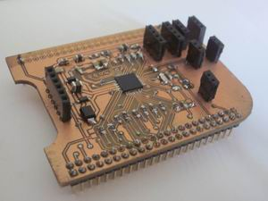
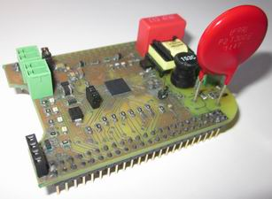

# plc-cape

Software framework for the **PlcCape** board, an AFE031-based cape for the BeagleBone Black designed
for Communications over Power Lines (PLC).

**PlcCape-v1 board** | **PlcCape-v2 board**
-------------------- | --------------------
 | 

Full documentation about the software framework (and some electronics) is available at
[PlcCapeSoftwareFramework.pdf](http://upcommons.upc.edu/bitstream/handle/2117/98244/PlcCapeSoftwareFramework.pdf)
Documentation about the electronic framework is in progress

## VERSIONS

[Changelog](CHANGELOG.md)

## CURRENT STATUS OF THE DEVELOPMENT

The software is in an early phase (hence the version 0.2).

The framework is consistent and stable but the specific implementation of each component would
still require considerable refactoring, bug fixing and improvements

## INSTALL

* Download source code and decompress it on any local folder
* Compile the source code depending on your needs:
  * To compile the whole framework just execute `make` from the root folder
  * To compile the BBB custom drivers (for SPI-DAC and ADC) go to the drivers folder and execute `make`
  * To compile the framework for a specific configuration use the PROFILE option like:
    * `make PROFILE=debug.bbb`
    * `make PROFILE=release.bbb`

## LICENSE

<pre>
	This project is free software: you can redistribute it and/or modify
	it under the terms of the GNU General Public License as published by
	the Free Software Foundation, either version 3 of the License, or
	(at your option) any later version.

	This project is distributed in the hope that it will be useful,
	but WITHOUT ANY WARRANTY; without even the implied warranty of
	MERCHANTABILITY or FITNESS FOR A PARTICULAR PURPOSE.  See the
	GNU General Public License for more details.

	You should have received a copy of the GNU General Public License
	along with this project.  If not, see <http://www.gnu.org/licenses/>
</pre>
For full terms see [LICENSE](LICENSE)

## COPYRIGHT

Copyright (C) 2016-2017 Jose Maria Ortega (<a href="mailto:jose77105@gmail.com">jose77105@gmail.com</a>)
